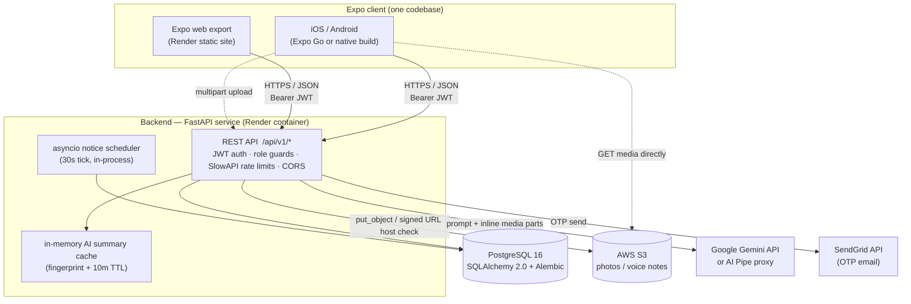
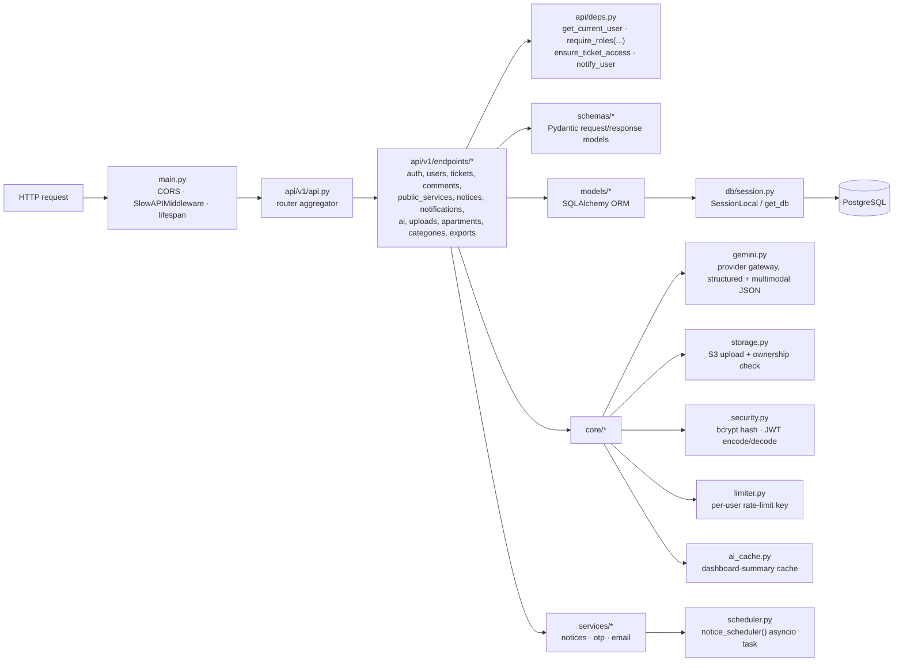
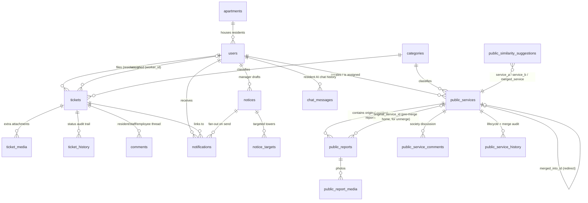
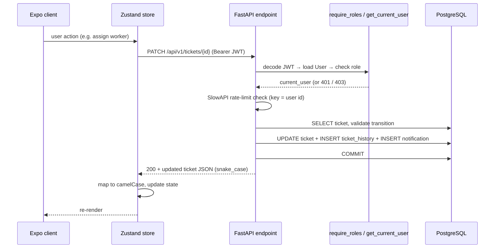

# Simplifix

Simplifix is an AI-assisted apartment community maintenance management system built by **Pied Piper (MAY2026-Team-048)** as a curriculum requirement for the **B.S. in Data Science and Applications, IIT Madras**.

The project replaces fragmented maintenance communication across WhatsApp messages, phone calls, and paper registers with a structured workflow for reporting, assigning, resolving, and tracking residential maintenance complaints.

> Current status: a live FastAPI + PostgreSQL backend (JWT auth, AWS S3 media storage, Google Gemini AI integration) backs the Expo React Native frontend end-to-end. See [`frontend/README.md`](./frontend/README.md) and [`backend/README.md`](./backend/README.md) for how each half works, and [`docs/`](./docs) for setup, deployment, and AWS S3 guides.

## Live Deployment

| | URL |
| --- | --- |
| Frontend | https://may2026-team-048.onrender.com/ |
| Backend API | https://simplifix-backend.onrender.com/ |
| Backend API docs (Swagger) | https://simplifix-backend.onrender.com/docs |

Both run on Render's free tier, which spins down after 15 minutes of inactivity — the first
request after a while can take 30-60s to wake back up. See [`docs/deployment.md`](./docs/deployment.md)
for how this is deployed.

## What the App Does

Simplifix centralizes the complete complaint lifecycle for apartment communities:

- Residents can create maintenance complaints, attach photos or voice notes, review AI-assisted complaint details, track status, verify completed work, and rate the resolution.
- Residents can publish common-area public service reports, discuss them with neighbours, and follow a shared resolution page when reports are merged.
- Facility employees can review incoming complaints, validate AI-generated descriptions, assign jobs to maintenance staff, monitor workloads, handle overdue complaints, and close a complaint from Pending with a required reason (e.g. already handled by an outside contractor, or not a real maintenance issue).
- Facility employees receive AI similarity suggestions for public reports, can hand-pick any set of open public reports and merge them into one combined page (then unmerge that page back into its sources while it is still unassigned), and can reject an implausible public report with a required reason.
- Maintenance staff can view assigned jobs, inspect complaint details and media, update repair progress, add remarks, and upload completion proof.
- Facility managers can monitor analytics, complaint trends, staff performance, workload distribution, recurring issues, and historical records, draft AI-assisted resident notices, and suspend or reactivate resident, employee, and maintenance-staff accounts. The manager workspace is desktop-first; on a phone it shows a "sign in from a desktop" notice.

The complaint lifecycle:

```text
Pending -> Assigned -> In Progress -> Resolved -> Resident Verification -> Closed
                    \-> Rejected  (facility employee closes it from Pending, reason required;
                                   used for contractor-handled or implausible complaints)
```

## Key Features

- AI-assisted complaint description, category, and priority suggestions, including flagging media/text that isn't a real maintenance issue
- AI-assisted manager notices with tower targeting, editable drafts, scheduled delivery, and expiry
- AI resident support chat and AI-generated role-specific dashboard summaries
- Media-based complaint reporting via AWS S3-backed photo/voice-note uploads
- Role-based app experience for residents, facility employees, maintenance staff, and facility managers; the manager workspace is desktop-first and shows a "use a larger screen" notice on phones
- Complaint status tracking from submission to closure, including an employee "close request" step from Pending (reason required)
- Facility-manager account suspension and reactivation for resident, employee, and maintenance-staff accounts, with a blocked-login screen for suspended users
- Worker assignment and workload visibility
- Completion proof, remarks, resident verification, and ratings
- Searchable complaint history and full audit trail
- Society-wide public service feed with comments and dedicated issue pages
- Employee-approved AI similarity scoring and information-preserving report merges, plus employee-driven manual merge of any open public reports and a reversible unmerge
- Manager analytics for resolution time, category trends, recurring issues, and staff performance

## Architecture

Simplifix is a two-tier system: a single Expo React Native client (iOS, Android, and web from one
codebase) talking to one stateless FastAPI service over HTTPS/JSON. The API owns all persistence
(PostgreSQL), all third-party credentials, and all AI calls — the client never holds a Gemini key,
an AWS key, or a database connection. There is no separate admin panel, worker service, or message
queue: role-specific behaviour is just route-group + permission logic on the two tiers.

- [`frontend/`](./frontend) — Expo React Native app (Expo Router, TypeScript, Zustand), talks to the backend over `EXPO_PUBLIC_API_URL`. See [`frontend/README.md`](./frontend/README.md).
- [`backend/`](./backend) — FastAPI + PostgreSQL API (SQLAlchemy 2.0, Alembic, JWT auth, Gemini AI gateway, AWS S3). See [`backend/README.md`](./backend/README.md).
- [`docs/`](./docs) — local setup, AWS S3 setup, and production deployment guides.

| Layer | Stack |
| --- | --- |
| Frontend | Expo SDK 54, Expo Router (file-based routing), React Native 0.81 / React 19, TypeScript, Zustand (+ `AsyncStorage` persistence), `expo-secure-store` for the JWT, Chart.js / Victory for analytics |
| Backend | FastAPI 0.115, Uvicorn, SQLAlchemy 2.0, Alembic, Pydantic v2 / `pydantic-settings`, SlowAPI (rate limiting), `python-jose` + `passlib`/`bcrypt` (JWT + hashing) |
| Database | PostgreSQL 16 (SQLite in-memory for the test suite) |
| AI | Google Gemini `generateContent` v1beta, or the AI Pipe Gemini-compatible proxy — selectable via `AI_PROVIDER`. Text + multimodal (image/audio) structured-JSON output |
| Media storage | AWS S3 (keyed `{folder}/{uploader_id}/{uuid}.{ext}` so ownership is checkable without a DB hit) |
| Email | SendGrid HTTP API (registration / password-reset OTP); no-ops with a warning if unconfigured |
| Local dev | Docker Compose (`db` + `api`, migrations run on container start) |
| Production | Render — backend container + managed Postgres; frontend as a static Expo web export. See [`docs/deployment.md`](./docs/deployment.md) |

### System context



### Backend internals

Layered FastAPI app under [`backend/app/`](./backend/app):



- **`core/config.py`** — single `Settings` object (`pydantic-settings`), reads `.env`; the only place secrets enter the process.
- **`core/gemini.py`** — dependency-free HTTP gateway. Same `generateContent` payload for Gemini and AI Pipe, `responseSchema` for structured output, `thinkingBudget: 0`, and `media_part()` which re-downloads an S3 object *only* if its URL matches the expected bucket host, then inlines it as base64. Provider errors are logged server-side and returned to clients as generic `503`s so tokens/payloads never leak.
- **`api/deps.py`** — `require_roles(*roles)` is the authorization primitive used on nearly every endpoint; `notify_user()` is the single choke point for creating `Notification` rows (so a future push-notification feature is a one-place change).
- **`scheduler.py` + `services/notices.py`** — an `asyncio` task started in the FastAPI `lifespan`, ticking every 30s to dispatch `Scheduled` notices (server time, `SELECT ... FOR UPDATE SKIP LOCKED`) and expire `Sent` ones. No external cron/worker.
- **`core/ai_cache.py`** — process-local cache for `GET /ai/dashboard-summary`, keyed by `(user_id, role)` and a SHA-256 fingerprint of the stats text, with a 10-minute TTL; ticket/user mutations call `invalidate_summaries()`.
- **`alembic/`** — schema is migration-managed; `docker compose up` and the Render start command both run `alembic upgrade head` before the API serves traffic.

### Frontend internals

File-based Expo Router app under [`frontend/src/`](./frontend/src):

| Folder | Role |
| --- | --- |
| `app/` | Screens as routes. `_layout.tsx` hydrates the session, loads fonts, and routes into one of the role groups. `index.tsx` redirects by role/auth state. |
| `app/(auth)/` | Landing, login (resident + employee variants), register, OTP forgot-password, pending-approval, change-password. |
| `app/(resident)/`, `(employee)/`, `(maintenance)/`, `(manager)/` | One route group per role, each with a `(tabs)/` set plus detail screens (`complaint/[id]`, `job/[id]`, `public/[id]`, `notice/[id]`). A group only renders for its role. `(manager)` adds a `people` tab (account suspension) and, below the desktop breakpoint, renders `DesktopOnlyNotice` instead of the sidebar workspace. |
| `app/comments/[ticketId].tsx` | Shared ticket comment thread — polls the API every ~8s while open (no websockets). |
| `api/client.ts` | The entire backend contract in one typed module: `apiFetch` wrapper, `ApiError`, snake_case↔camelCase mappers, one function per endpoint. |
| `store/` | Zustand stores — `authStore` (persisted user, JWT in secure store), `ticketStore`, `publicServiceStore`, `noticeStore`, `notificationStore`, `themeStore`. Refreshed on login and on token change. |
| `components/ui/` | Design-system primitives (Button, Card, Badge, Chip, StatCard, charts, StatusStepper…). |
| `components/shared/` | Domain components built on the UI kit (TicketCard, CommentsThread, PublicServiceDetail, SimilarityReviewModal, NotificationBell, DesktopOnlyNotice…). |
| `constants/theme.ts` | Design tokens (colour, spacing, radius, type scale, shadows); light/dark via `themeStore` + `useTheme`. |
| `hooks/`, `utils/`, `types/` | Voice recorder, dashboard search, desktop breakpoint; date/id/overdue/validation helpers; shared TS types. |

### Domain data model

All four roles live in one `users` table with role-specific nullable columns. Private `tickets`
and society-wide `public_services` are deliberately separate trees.



Enum-driven lifecycles (`app/models/enums.py`):

- **Ticket** — `Pending → Assigned → In_Progress → Resolved → Closed`, with `Cancelled` (resident withdrawal) and `Rejected` (facility employee closes the request from `Pending`, reason required — surfaced in the app as "Close request", and excluded from resolution/SLA analytics).
- **Account** — `pending → active`, plus `rejected` (registration declined) and `suspended` (a facility manager revokes a previously-active resident/employee/maintenance account; reversible back to `active`, managers can't be suspended). Suspended and rejected users still get a token, but every role's route guard sends them to an explanatory screen.
- **Public service** — `Pending → Assigned → In_Progress → Resolved`, plus `Rejected` and `Merged`. A merge — an AI-suggested pair, or an employee-picked set of any size — creates a new combined page and turns each source into an immutable redirect via `merged_into_id`; an employee can unmerge a still-unassigned combined page, which restores every report/comment to its pre-merge page via `original_service_id` and deletes the combined page.
- **Notice** — `Draft → Scheduled → Sent → Expired`, with `Cancelled` before delivery.
- **Similarity suggestion** — `Pending → Accepted | Declined` (employee decision; accepting creates the merged page, unmerging that page reopens the suggestion).

### Request lifecycle (authenticated call)



### Cross-cutting flows

- **Auth** — `POST /auth/login` (OAuth2 password flow) returns a 24h HS256 JWT; the client stores it in `expo-secure-store` and sends it as `Authorization: Bearer`. Residents/managers are active on registration; employees/maintenance staff start `pending` until a facility employee or manager promotes them. A facility manager can also `suspend` any active resident/employee/maintenance account (and later reactivate it) from the manager **People** screen; suspended and rejected users receive a token but every route guard bounces them to an explanatory screen. Password reset and change use emailed OTPs (SendGrid).
- **Media** — client uploads multipart to `POST /uploads/`; the API validates type/size, writes to S3 under `{folder}/{uploader_id}/{uuid}`, and returns the URL. The client then GETs media straight from S3. AI endpoints re-fetch media server-side and verify the S3 host + uploader before sending it to Gemini.
- **AI** — every AI feature (complaint analysis, resident chat, notice drafting, dashboard summaries, public-report similarity) goes through `core/gemini.py`; endpoints are per-user rate-limited (6–15/min). Complaint analysis also flags media/text that isn't a real maintenance issue.
- **Public-report merge / unmerge** — a new public report is AI-scored against recent unresolved services; scores above `PUBLIC_SIMILARITY_THRESHOLD` (0.80) create an employee review suggestion + notification that the employee accepts or declines. Separately, an employee can tick any set of open public services on the Public Services tab and merge them directly (`POST /public-services/merge`). Both paths run one `_merge_services` helper: it builds a combined page, moves every report/comment onto it, and records each one's pre-merge page. A combined page that is still `Pending` and unassigned can be unmerged (`POST /public-services/{id}/unmerge`) — reports/comments go back and the combined page is deleted.
- **Realtime** — none. Comment threads and notifications are polled (~8s while a thread is open); scheduled notices are delivered by the in-process scheduler.

### Environments

| | Frontend | Backend | Database | Media | AI |
| --- | --- | --- | --- | --- | --- |
| **Local** | `npx expo start` → device/web, `EXPO_PUBLIC_API_URL` points at the Docker API | `docker compose up` (Uvicorn `--reload`, migrations on start) | Postgres 16 container | Real S3 bucket (see [`docs/s3-setup.md`](./docs/s3-setup.md)) | Gemini or AI Pipe key in `backend/.env` |
| **Test** | Jest + `jest-expo` | pytest against `TestClient` | SQLite in-memory | `mock_s3` fixture | provider calls mocked |
| **Production** | Expo web export on Render static hosting | Render Docker web service (`alembic upgrade head` then Uvicorn) | Render managed Postgres (internal URL, `+psycopg2`) | Same S3 bucket | Provider key as a Render env var |

## Instructions: Run It Locally

Both halves — backend API and Expo app — need to be running together. Start the backend first,
then the frontend.

### Prerequisites

- **Git**
- **Docker Desktop** (runs Postgres + the API in containers — no manual Postgres install). See
  [`docs/setup.md`](./docs/setup.md) if you'd rather install PostgreSQL natively instead.
- **Node.js and npm**, for the Expo frontend
- An Expo-compatible target: Android Emulator, iOS Simulator, a web browser, or a physical phone
  with the **Expo Go** app

### 1. Clone and start the backend

```bash
git clone <this repo's URL>
cd MAY2026-Team-048/backend
cp .env.example .env
docker compose up --build
```

Leave this running in its own terminal. The first run takes a minute or two to build; it also
runs database migrations automatically before the API starts.

### 2. Seed data (one-time, in a second terminal)

```bash
cd backend
docker compose exec api python -m scripts.seed_categories     # required
docker compose exec api python -m scripts.seed_demo_users     # optional - enables the demo-login buttons
docker compose exec api python -m scripts.seed_demo_services  # optional - sample tickets/public services
```

### 3. Confirm the backend is up

Open http://localhost:8000/docs in a browser — you should see the interactive Swagger UI. Or:

```bash
curl http://localhost:8000/health
# {"status":"ok"}
```

### 4. Set up and start the frontend

In a third terminal:

```bash
cd frontend
npm install
cp .env.example .env
```

Open `frontend/.env` and set `EXPO_PUBLIC_API_URL` to where the backend is reachable from your
Expo target:

| Target | `EXPO_PUBLIC_API_URL` |
| --- | --- |
| Web browser or iOS Simulator (same machine) | `http://localhost:8000` |
| Android Emulator | `http://10.0.2.2:8000` |
| Physical phone (Expo Go) | `http://<your machine's LAN IP>:8000` — find it with `ipconfig` (Windows) / `ifconfig` (macOS/Linux); phone and computer must be on the same Wi-Fi |

Then start Expo:

```bash
npx expo start
```

In the Expo terminal: press `w` for web, `a` for Android Emulator, `i` for iOS Simulator, or scan
the QR code with Expo Go on your phone.

### 5. Log in

On the login screen, tap any demo account (Resident, Facility Employee, Maintenance Staff,
Facility Manager) if you ran the optional seed scripts in step 2 — or register a real account.

### Troubleshooting and other setups

- Full step-by-step guide, including a no-Docker/native-PostgreSQL option and a troubleshooting
  table: [`docs/setup.md`](./docs/setup.md)
- Full frontend setup details: [`frontend/README.md`](./frontend/README.md)
- Testing photo/voice-note uploads locally needs AWS S3 configured: [`docs/s3-setup.md`](./docs/s3-setup.md)
- Deploying the backend (Render): [`docs/deployment.md`](./docs/deployment.md)

## Roles

| Role              | Route group     | Primary responsibilities                                                                |
| ----------------- | --------------- | ----------------------------------------------------------------------------------------- |
| Resident          | `(resident)`    | Submit complaints, attach media, track progress, verify completion, rate work           |
| Facility Employee | `(employee)`    | Review complaints, validate AI output, assign workers, close complaints from Pending (reason required), merge / unmerge public service reports, monitor pending/overdue work |
| Maintenance Staff | `(maintenance)` | View assigned jobs, update progress, add remarks, upload completion proof               |
| Facility Manager  | `(manager)`     | Review analytics, monitor performance, inspect history, identify recurring issues, draft notices, suspend / reactivate accounts (People tab). Desktop-first — phones show a "use a larger screen" notice |

## Contributors

- Abhay Sharma - [@asabhaysharma](https://github.com/asabhaysharma)
- Anusha Saha - [@anusha-saha-3007](https://github.com/anusha-saha-3007)
- Mursleen Khan - [@MursleenK](https://github.com/MursleenK)
- Namit Gupta - [@NamitCodes](https://github.com/NamitCodes)
- Sadaan Baksh - [@SadaanBaksh](https://github.com/SadaanBaksh)

## Team

**Pied Piper (MAY2026-Team-048)**

Project made as part of the curriculum requirement for the **B.S. in Data Science and Applications, IIT Madras**.
